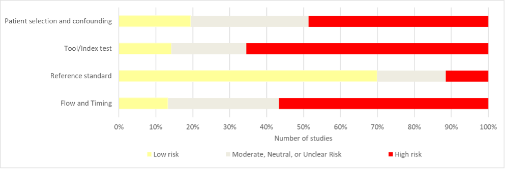

## The Clinical Challenge {.smaller}

**Adult ADHD diagnosis remains complex despite established DSM-5 criteria:**

- Hyperactivity/impulsivity symptoms often diminish with age
- Inattentive symptoms are subtle and may not impair until adulthood
- Retrospective recall of childhood symptoms is often inaccurate
- Substantial symptom overlap with depression, anxiety, bipolar disorder
- Growing number seeking stimulants for cognitive enhancement
- Most diagnoses made by primary care providers, not specialists
- No established "gold standard" diagnostic approach

**Key Question:** Which diagnostic tools actually help distinguish adult ADHD from other conditions?

---

## Study Scope and Methods {.smaller}

**Comprehensive Systematic Review (PROSPERO: CRD42025638106)**

- **112 studies** evaluating diagnostic tools for adult ADHD
- Multiple databases searched without date restrictions
- Studies from 18 countries with sample sizes from dozens to >1,000 participants
- Evaluated 9 categories of diagnostic approaches:
  - Self-report questionnaires (44 studies)
  - Neuropsychological tests (26 studies) 
  - EEG studies (12 studies)
  - Neuroimaging (5 studies)
  - Biomarkers (5 studies)
  - Peer reports (3 studies)
  - Clinician tools (3 studies)
  - Combination approaches (7 studies)
  - Feigning detection tools

---

## Overall Quality of Evidence {.smaller}

**Strength of Evidence: Predominantly LOW across all modalities**

{fig-align="center" width="80%"}

**Major Limitations:**
- High risk of bias in patient selection (47% of studies)
- High risk of bias in index test application (67% of studies)
- Wide performance variability across studies using same tools
- Limited direct head-to-head comparisons (only 11 studies)
- Most studies used neurotypical controls rather than clinical samples

---

## Self-Report Questionnaires: The Workhorse Tool {.smaller}

**Most extensively studied modality (44 studies)**

**Performance Characteristics:**
- **Sensitivity:** Highly variable (14% to 100%)
- **Specificity:** Highly variable (10% to 99%)
- **Administration:** Short (<30 minutes)
- **Clinical misdiagnosis:** Substantial false negative rates (12-90%)

**Key Clinical Insight:**
Self-reports excel at either sensitivity OR specificity, rarely both simultaneously. Performance heavily depends on:
- Diagnostic threshold applied
- Comparison population (neurotypical vs. clinical)
- Presence of comorbid conditions

**Most studied scales:** CAARS, ASRS, WURS

---

## Neuropsychological Testing: Limited Clinical Value {.smaller}

**26 studies of CPTs and cognitive batteries**

**Performance Reality Check:**
- **False negative rates:** Substantial (11-60%)
- **Sensitivity:** Mostly fair or poor (17-93%)
- **Specificity:** Wide variation (40-100%)
- **Administration time:** ~20 minutes
- **Clinical utility:** Does NOT outperform self-report measures

**Critical Finding:** 
Neuropsychological tests perform **no better than** self-report questionnaires and often perform **worse** despite being more time-intensive and expensive.

**Bottom Line:** Traditional neuropsychological batteries and CPTs alone are not sufficient for ADHD diagnosis in adults.

---

## Advanced Technologies: Promise vs. Reality {.smaller}

**EEG Studies (12 studies):**
- Sensitivity: 67-100% | Specificity: 37-95%
- **Limitation:** Highly exploratory, complex methods difficult to replicate

**Neuroimaging (5 studies):**
- Sensitivity: 54-100% | Specificity: 65-97% 
- **Limitation:** Ad hoc analyses, limited real-world applicability

**Biomarkers (5 studies):**
- Eye tracking, genetics, oxidative stress, wearable devices
- **Limitation:** Each study used different technology

**Clinical Reality:** 
Despite some promising accuracy metrics, these technologies are **not ready for clinical implementation** due to limited accessibility, lack of standardization, and absence of replication studies.

---

## Combination Approaches: The Future Direction {.smaller}

**7 studies evaluated multi-modal combinations**

**Promising Performance:**
- **False positive rates:** Moderate (16-18%)
- **Sensitivity:** Mostly good (43-94%)
- **Specificity:** Acceptable (82-94%)

**Effective Combinations:**
- Self-report + Informant ratings
- Self-report + Neuropsychological measures  
- Self-report + EEG data
- Multiple self-report scales + demographic variables

**Evidence Statement (Low SOE):**
Combinations of assessment modalities generally **outperformed single modalities** for both sensitivity and specificity.

---

## Context Matters: Neurotypical vs. Clinical Samples {.smaller}

**Critical Clinical Insight:**

{fig-align="center" width="75%"}

**Real-World Impact:**
- Tools perform better when distinguishing ADHD from neurotypical adults
- Performance drops significantly when distinguishing ADHD from other psychiatric conditions
- **Clinical relevance:** Patients rarely present as "healthy controls" - they have overlapping symptoms

**Comorbidity Effects:**
- Depression and anxiety elevate ADHD symptom scores
- Specificity particularly affected by psychiatric comorbidities
- Need to assess overlapping conditions systematically

---

## Clinical Practice Implications {.smaller}

**For Primary Care and Specialty Settings:**

**Self-Report Screening:**
- Quick and efficient first step
- **Negative result:** Reassuring but not conclusive - assess other conditions
- **Positive result:** Requires validation through clinical interview

**Essential Follow-up for Positive Screens:**
- Detailed symptom elaboration in patient's own words
- Childhood symptom confirmation from collateral sources
- Systematic screening for depression (PHQ-9) and anxiety (GAD-7)
- Assessment of functional impairment patterns

**Neuropsychological Testing:**
- **Not routinely helpful** for ADHD diagnosis
- May serve other clinical purposes (cognitive profiling)
- Consider only as part of comprehensive evaluation

---

## Future Research Priorities {.smaller}

**Critical Research Needs:**

1. **Standardized head-to-head comparisons** across assessment modalities
2. **Primary care validation studies** - most diagnoses occur in primary care
3. **Diverse population studies** stratified by age, sex, ethnicity, and comorbidity
4. **Optimal combination algorithms** with explicit rationale
5. **Childhood onset validation methods** - core diagnostic requirement
6. **Brief screening tools** specifically designed for primary care

**Study Design Improvements:**
- Move beyond neurotypical comparison groups
- Report ROC curves and AUCs for threshold-independent comparisons
- Make individual-level data publicly available
- Assess clinical consequences of diagnostic accuracy/inaccuracy

**Bottom Line:** Current evidence supports multi-method assessment combining self-reports, informant ratings, and clinical evaluation.
